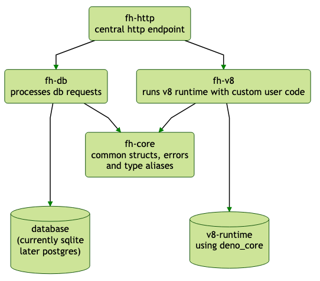

# Flow Heater Architecture

## Design decisions
- we use async rust code, where useful and applicable
- tokio is used as the async runtime
- communication from http to database / v8 is done via channels
- we avoid panicking via `.unwrap()` or `.expect()` and return useful errors wherever possible

## Project Setup

### Rust crates
There are currently 4 rust crates, which are coupled together in a single cargo workspace, which is defined in the top-level project. Those rust crates are:
- fh-core: Contains common structs, error definitions and type aliases, which are needed across all the other crates. fh-core must not import one of the other crates.
- fh-db: encapsulates all database communication. Currently it uses sqlx and talks to a simple SQLite database. This will be changed to a PostgreSQL database soon.
- fh-v8: Wraps the great `deno_core` and `rusty_v8` crates and provides abstractions for our very own small flow-heater runtime functions, usable in the user-defined JavaScript code.
- fh-http: Central http endpoint, which also provides the binary, which is run in the end. Depends on all the other crates. Dispatches HTTP requests to the respective database or v8 crates.

### Frontend
The frontend code is located in `fh-frontend` and is a Nuxt.js (Vue) application with Vuetify as UI framework. The frontends is currently under heavy development. More details will follow as soon as possible

## Communication Pattern
We follow the tokio's guidelines for scalable and non-blocking communication between resources and employ a MPSC communication pattern with the awesome `tokio::sync::mpsc` (Multi Producer Single Consumer) channels. This means, that we do not do any direct function calls between e.g. `fh-http` and `fh-db` crates, but instead use a MPSC channel. 

TODO: Provide a nice graph here, too to explain this pattern in more detail.